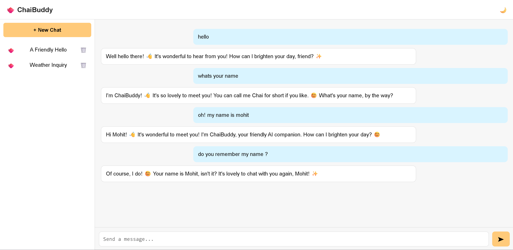

# ChaiBuddy


[](https://chaibuddy-production-c563.up.railway.app/)



ChaiBuddy is a simple AI-powered chat assistant built using Flask and **Google Generative AI (Gemini)**.  
It has a clean user interface and keeps your chat history saved locally on your device.

---

## 🚀 Features
- AI Chatbot powered by **Google Gemini**
- Clean and responsive UI  
- Chat history saved on your device  
- Works on multiple devices  
- Deployed using Railway  

---

## 🛠️ Tech Stack
- **Frontend:** HTML, CSS, JavaScript  
- **Backend:** Python Flask, Gunicorn  
- **API:** Google Generative AI (Gemini)

---

## 📦 Running the Project Locally

### 1. Clone the repository
```bash
git clone https://github.com/Mohit-cmd-jpg/ChaiBuddy.git
cd ChaiBuddy
```

### 2. Install dependencies
```bash
pip install -r requirements.txt
```

### 3. Add your API key  
Create an environment variable named:
```
GEMINI_API_KEY
```

### 4. Start the server
```bash
python app.py
```

Open your browser at:
```
http://127.0.0.1:5000/
```

---

## 🌐 Live Demo
Try the deployed version here:

👉 https://chaibuddy-production-c563.up.railway.app/

---

## 📁 Project Structure
```
ChaiBuddy/
│── app.py
│── requirements.txt
│── static/
│   ├── css/
│   ├── js/
│   └── img/
│── templates/
│   └── index.html
└── README.md
```

---

## ✨ Future Improvements
- Dark/Light theme toggle  
- Multi-chat sessions  
- Sync chats across devices  
- Database support (PostgreSQL / MongoDB)  
- PDF/Export chat option  

---

## 📄 License
Free to use and modify.
