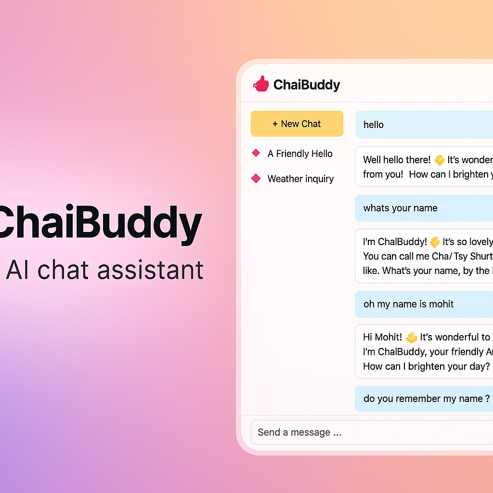

<p align="center">
  
</p>

# ChaiBuddy


---


ChaiBuddy is a simple AI-powered chat assistant built using Flask and **Google Generative AI (Gemini)**.  
It has a clean user interface and keeps your chat history saved locally on your device.

## ✨ Features at a Glance

<p align="center" style="font-size: 26px;">
  ✨ 🤖 ⚡ 💬 🎨
</p>

---

## 🚀 Features

- AI Chatbot powered by **Google Gemini**  
- Clean and responsive UI  
- Chat history saved locally on your device  
- Light/Dark theme toggle with persistent preference  
- Multi-chat sessions with smart titles  
- Export current chat to PDF via browser  
- Works on all screen sizes  
- Deployed using Railway  

---

## 🛠️ Tech Stack

<p align="left">
  


</p>

---

## 📦 Running the Project Locally

### 1. Clone the repository
```bash
git clone https://github.com/Mohit-cmd-jpg/ChaiBuddy.git
cd ChaiBuddy
```

### 2. Install dependencies
```bash
pip install -r requirements.txt
```

### 3. Add your API key  
Create an environment variable:
```
GEMINI_API_KEY
```

### 4. Start the server
```bash
python app.py
```

Open your browser at:
```
http://127.0.0.1:5000/
```

---

## 🌐 Live Demo

Try the deployed version here:

👉 https://chaibuddy-kmwk.onrender.com/

---

## 📁 Project Structure

```
ChaiBuddy/
│── app.py
│── requirements.txt
│── static/
│   ├── css/
│   ├── js/
│   └── img/
│── templates/
│   └── index.html
└── README.md
```

---

## ✨ Future Improvements

- Sync chats across devices  
- Database support (PostgreSQL / MongoDB)  

---

## 📄 License

This project is open-source under the MIT License.

---

<p align="center">
  Made with ❤️ by <strong>Mohit Bindal</strong>
</p>

